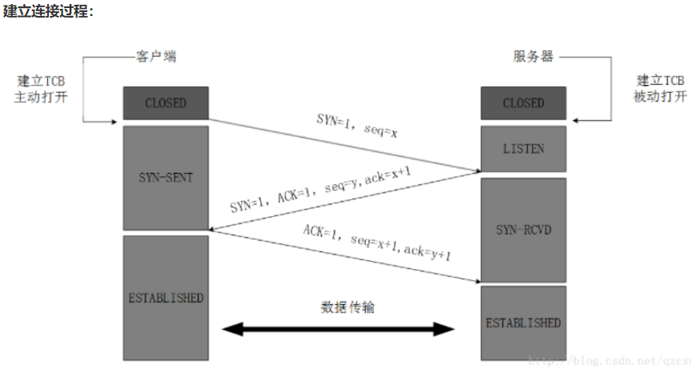
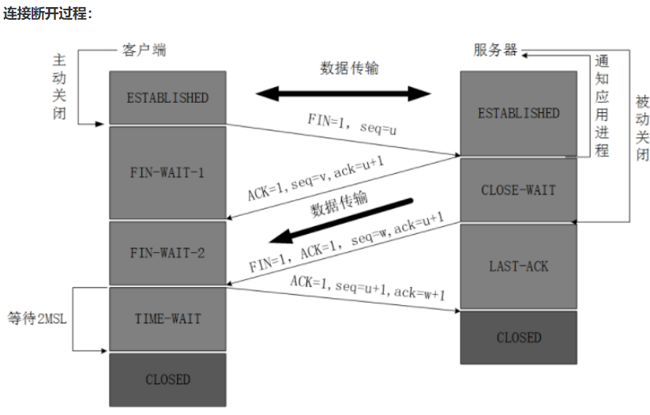
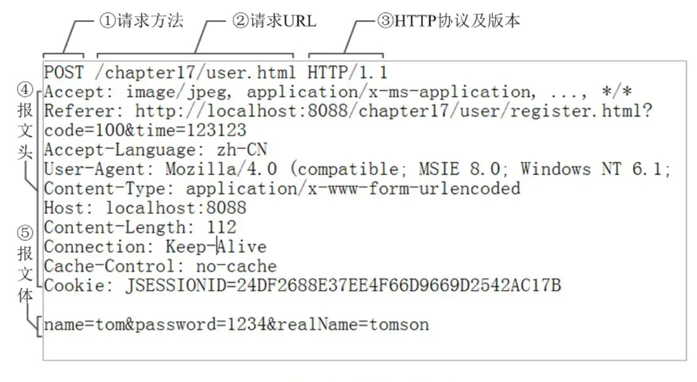

### HTTP
>HTTP协议即**超文本传送协议( Hypertext Transfer Protocol )**，是Web联网的基础，也是手机联网常用的协议之一，HTTP协议是建立在TCP协议之上的一种应用( **TCP是传输层，而http是应用层** )。

HTTP的**交互流程**简单来讲就是客户端与服务器端的通信，包括客户端对服务器端的请求以及服务器端对客户端的响应。

客户端与服务器端建立一个连接，三次握手经历完成之后才能建立一个稳定可靠的连接。
#### 三次握手
1. 客户端给服务器端发送一个syn的标志位；
2. 服务器端接收到syn后会返回一个ack(相当于一个回调的机制)，同时还有一个服务器端的syn；
3. 客户端接收服务器端发送的syn后会再次给服务器端发送一个ack，这样才算完成三次握手。

#### 四次分手
1. 客户端向服务器端发送断开连接的请求；
2. 服务器端接收到请求后，返回可以断开连接的请求，客户端断开连接并且释放资源；
3. 服务器端向客户端发送断开连接的信息；
4. 客户端向服务器端发送同意断开连接的信息，服务器端断开连接释放资源。

**建立连接要3次，断开为什么要4次呢**
因为tcp是全双工的(指可以同时进行双向传输A->B,B->A)，每个方向要单独断开，每个方向2次，所以4次。
**协议规范**
HTTP协议是一个规范。一定会限制请求的格式。
http协议的请求格式分为3个部分：请求行、请求头、请求体。
**请求行**
包括三个属性。描述对应的请求的时候，最精确的形式就是K-V键值对的格式。
请求头中也是一堆的K-V数据。包含头信息中的一些附加信息(比如客户端允许接收的信息格式)。
**请求头**
提供了关于请求,响应或者其他的发送实体的信息
**Content-Type**
   - text/plain 纯文本
   - application/x-www-form-urlencoded 指定内容类型为键值对
   - application/octet-stream 二进制流数据
   - application/json json数据格式
   - multipart/form-data formdata表单数据格式
   - 
**请求体**
当发送某一个请求的时候，请求后面可以加一些用户定义的参数(比如表单)。以K=V的形式发送给后台。

### 跨域
什么是跨域
跨域是指从一个域名的网页去请求另一个域名的资源。比如从www.baidu.com 页面去请求 www.googl
e.com 的资源。跨域的严格一点的定义是：只要协议，域名，端口有任何一个的不同，就被当作是跨
域。
为什么浏览器要限制跨域访问呢？
原因就是安全问题：如果一个网页可以随意地访问另外一个网站的资源，那么就有可能在客户完全不知
情的情况下出现安全问题。
为什么要跨域（从一个页面引用其它页面的资源）
既然有安全问题，那为什么又要跨域呢？有时公司内部有多个不同的子域，比如一个是
location.company.com ,而应用是放在app.company.com , 这时想从 app.company.com去访问
location.company.com 的资源就属于跨域
npm i multiparty -S
router.post("/test", function(req, res) {
var form = new multiparty.Form();
form.parse(req, function(err, fields, files) {
//fields：类似post 的一些字符串，
//files 文件
})
})
前端开发深入解读，让每一个逻辑清晰起来；技术交流QQ：2429462491 前端开发深入解读，让每一个逻辑清晰起来；技术交流QQ：2429462491 第30页
跨域解决方案
cors
nginx
jsonp
cors
nginx
Windows: 在nginx目录查找nginx.conf文件并添加以下内容
Mac: open -t /usr/local/etc/nginx/nginx.conf
mac默认ng端口8080
关于Mac下操作：
brew services start nginx
brew services stop nginx
jsonp
app.use(function (req, res, next) {
res.setHeader('Access-Control-Allow-Origin', '*');
res.setHeader('Access-Control-Allow-Methods', 'GET, POST, OPTIONS, PUT,
DELETE');
res.setHeader('Access-Control-Allow-Headers', '*');
next();
});
server {
listen 8089;
server_name localhost;
root html; #根目录
# cors
add_header Access-Control-Allow-Origin $http_origin always; # '*'
add_header Access-Control-Allow-Credentials true always;
add_header Access-Control-Allow-Methods 'GET, POST, OPTIONS' always;
add_header Access-Control-Allow-Headers 'DNT,X-Mx-ReqToken,KeepAlive,User-Agent,X-Requested-With,If-Modified-Since,Cache-Control,ContentType,Authorization' always;
#请求http://localhost:8080/api，将该请求转发到http://localhost:3000/api
location /api {
proxy_pass http://localhost:3000/api;
}
}
app.get("/api/jsonp", function(req, res){
var data = {name: "jsonp数据"}
data = JSON.stringify(data); //转字符串
var callback = `${req.query.callback}(${data})`; //函数名+数据
console.log(callback)
res.send(callback);
})
function getJsonp() {
$.ajax({
url: "http://localhost:3000/api/jsonp",
data: {name: "xxxx"},
dataType: "jsonp",
jsonpCallback: "handleResponse"
})
};
function handleResponse(data) {
console.log(data);
}

前端开发深入解读，让每一个逻辑清晰起来；技术交流QQ：2429462491 前端开发深入解读，让每一个逻辑清晰起来；技术交流QQ：2429462491 第31页
设计模式
设计模式（Design Pattern）是前辈们对代码开发经验的总结，是解决特定问题的一系列套路。它不是
语法规定，而是一套用来提高代码可复用性、可维护性、可读性、稳健性以及安全性的解决方案。
1995 年，GoF（Gang of Four，四人组/四人帮）合作出版了《设计模式：可复用面向对象软件的基
础》一书，共收录了 23 种设计模式，从此树立了软件设计模式领域的里程碑，人称「GoF设计模式」。
这些模式可以分为三大类：创建型模式（Creational Patterns）、结构型模式（Structural
Patterns）、行为型模式（Behavioral Patterns）。
创建型模式
工厂模式（Factory Pattern）
抽象工厂模式（Abstract Factory Pattern）
单例模式（Singleton Pattern）
建造者模式（Builder Pattern）
原型模式（Prototype Pattern）
结构型模式
适配器模式（Adapter Pattern）
桥接模式（Bridge Pattern）
过滤器模式（Filter、Criteria Pattern）
组合模式（Composite Pattern）
装饰器模式（Decorator Pattern）
外观模式（Facade Pattern）
享元模式（Flyweight Pattern）
代理模式（Proxy Pattern）
行为型模式
责任链模式（Chain of Responsibility Pattern）
命令模式（Command Pattern）
解释器模式（Interpreter Pattern）
迭代器模式（Iterator Pattern）
中介者模式（Mediator Pattern）
备忘录模式（Memento Pattern）
观察者模式（Observer Pattern）
状态模式（State Pattern）
空对象模式（Null Object Pattern）
策略模式（Strategy Pattern）

