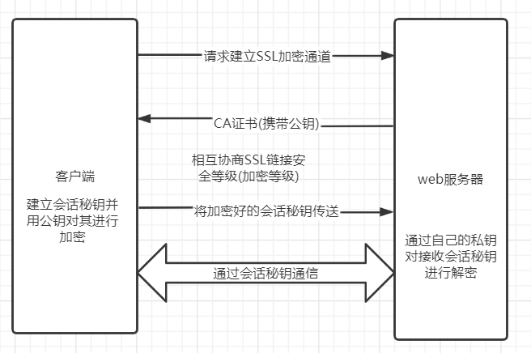

- [http 和 https](#http-和-https)
  - [基本概念](#基本概念)
  - [区别](#区别)
  - [https 工作原理](#https-工作原理)
  - [TCP三次握手   syn  ack](#tcp三次握手---syn--ack)
  - [TCP四次挥手  FIN seq  ack](#tcp四次挥手--fin-seq--ack)
  - [TCP和UDP的区别](#tcp和udp的区别)
  - [跨域问题](#跨域问题)
  - [cookie、sessionStorage、localStorage的区别](#cookiesessionstoragelocalstorage的区别)
- [浏览器重绘与重排](#浏览器重绘与重排)
  - [区别](#区别-1)
  - [如何触发重排和重绘？](#如何触发重排和重绘)
  - [如何避免重绘或者重排？](#如何避免重绘或者重排)
- [介绍节流防抖原理、区别以及应用](#介绍节流防抖原理区别以及应用)
- [简述MVVM](#简述mvvm)
- [event Bus 就是Vue中的 $on和$emit调用对象](#event-bus-就是vue中的-on和emit调用对象)
- [this.$nextTick](#thisnexttick)
  - [实现](#实现)
  - [实现原理](#实现原理)
- [slot插槽](#slot插槽)
- [Promise怎么实现异步](#promise怎么实现异步)
- [Canvars 基本操作](#canvars-基本操作)
- [webpack](#webpack)
### http 和 https 
#### 基本概念
- http-是一个客户端和服务器**请求与应答**的标准（TCP），用于 *从万维网（www）服务器* 传输超文本到 *本地浏览器* 的**超文本传输协议**。
- https-是一个网络**安全通信**的传输协议，是以安全为目标的http通道，即在http下，加入 ssl 层进行加密。目的是提供对网站服务器的身份认证，保护交换数据的隐私与完整性。

#### 区别
- http-连接简单（**TCP握手**），无状态的，明文传输，默认端口号是80，无费用，工作在**应用层**。
【简单快速，灵活】
- https-连接握手费时（**TCP握手+ssl握手**，延长50%页面加载时长，增加10%~20%耗电），安全ssl加密传输，默认端口443，费用高需要CA证书，工作在**传输层**，**连接缓存**不如HTTP高效。
【保护隐私，数据完整性，身份认证】

#### https 工作原理

1. 客户端使用 https url 访问服务器，则**要求** web 服务器**建立 ssl 链接**。
2. web 服务器接收到客户端的请求之后，会**将携带公钥的网站的证书**（证书中包含了公钥），传输给客户端。
3. 客户端和 web 服务器端开始**协商 SSL 链接的安全等级**，也就是加密等级。
4. 客户端浏览器通过双方协商一致的安全等级，**建立会话密钥**，然后通过网站的**公钥来加密会话密钥**，并传送给网站。
5. web 服务器通过自己的**私钥解密**出会话密钥。
6. web 服务器通过**会话密钥加密**与客户端之间的通信。

#### TCP三次握手   syn  ack
> 1. 客户端syn请求->服务端器    |   syn_sent-发送
> 2. 服务器ack确认+发送syn->客户端  |   syn_recv-接收
> 3. 客户端ack确认回应->服务器  |   established-已建立连接。
> 
第一次握手：`建立连接时，客户端发送syn包（syn=j）到服务器，并进入SYN_SENT状态，等待服务器确认`；SYN：同步序列编号（Synchronize Sequence Numbers）。
第二次握手：`服务器收到syn包并确认客户的SYN（ack=j+1），同时也发送一个自己的SYN包（syn=k）`，即SYN+ACK包，此时服务器进入`SYN_RECV`状态；
第三次握手：`客户端收到服务器的SYN+ACK包，向服务器发送确认包ACK(ack=k+1）`，此包发送完毕，客户端和服务器进入`ESTABLISHED`（TCP连接成功）状态，完成三次握手。

#### TCP四次挥手  FIN seq  ack
> 1. 客户端seq请求释放->服务器  |   客户端FIN_WAIT_1终止等待状态1
> 2. 服务器ack同意释放+seq->客户端  |   服务端CLOSE_WAIT关闭等待状态；客户端接收ack+seq进入FIN_WAIT_2终止等待状态2
> 3. 服务器传输完最后数据seq准备关闭服务->客户端    |   服务器LAST_ACK等待客户端最后确认状态。
> 4. 客户端ack确认关闭->服务器  |   客户端TIMW_WAIT时间等待状态，等待2MSL的时间后，进入关闭状态CLOSED；服务端接收ack立即关闭CLOSED状态。
1. 第一次挥手：客户端`进程发出连接释放报文，并且停止发送数据。释放数据报文首部，FIN=1，其序列号为seq=u（等于前面已经传送过来的数据的最后一个字节的序号加1），此时，客户端进入FIN-WAIT-1（终止等待1）状态。` TCP规定，FIN报文段即使不携带数据，也要消耗一个序号。
2. 第二次挥手：服务器`收到连接释放报文，发出确认报文，ACK=1，ack=u+1，并且带上自己的序列号seq=v，此时，服务端就进入了CLOSE-WAIT（关闭等待）状态。`TCP服务器通知高层的应用进程，客户端向服务器的方向就释放了，这时候处于半关闭状态，即客户端已经没有数据要发送了，但是服务器若发送数据，客户端依然要接受。这个状态还要持续一段时间，也就是整个CLOSE-WAIT状态持续的时间。
3. 客户端`收到服务器的确认请求后，此时，客户端就进入FIN-WAIT-2（终止等待2）状态，`等待服务器发送连接释放报文（在这之前还需要接受服务器发送的最 后的数据）。
4. 第三次挥手：服务器`将最后的数据发送完毕后，就向客户端发送连接释放报文，FIN=1，ack=u+1，由于在半关闭状态，服务器很可能又发送了一些数据，假定此时的序列号为seq=w，此时，服务器就进入了LAST-ACK（最后确认）状态`，等待客户端的确认。
5. 第四次挥手：客户端`收到服务器的连接释放报文后，必须发出确认，ACK=1，ack=w+1，而自己的序列号是seq=u+1，此时，客户端就进入了TIME-WAIT（时间等待）状态。`注意此时TCP连接还没有释放，必须经过2∗∗MSL（最长报文段寿命）的时间后，当客户端撤销相应的TCB后，才进入CLOSED状态。
6. 服务器只要收到了客户端发出的确认，立即进入CLOSED状态。同样，撤销TCB后，就结束了这次的TCP连接。可以看到，服务器结束TCP连接的时间要比客户端早一些。

#### TCP和UDP的区别
- TCP是面向链接的，而UDP是面向无连接的。
- TCP仅支持单播传输，UDP 提供了单播，多播，广播的功能。
- TCP的三次握手保证了连接的可靠性; 
  UDP是无连接的、不可靠的一种**数据传输协议**，首先不可靠性体现在无连接上，通信都不需要建立连接，对接收到的数据也不发送确认信号，发送端不知道数据是否会正确接收。
- UDP的头部开销比TCP的更小，数据传输速率更高，实时性更好。
  
#### 跨域问题 
**原因**：浏览器同源策略-**域名-协议-端口号**不一致不能访问其他网站
**解决**
1. jsonp(script标签src属性callBack回调函数->get方法,后台传入特殊数据格式)
2. cors（后台设置`res.header('Access-Control-Allow-Origin', '*')`
3. proxy代理（后台nginx）
4. h5 中的window.postMessage()
5. cookie属性domain（使用二级域名共享cookie）
前端fetch/axios请求里报文header中，设置withCredentials（跨域时是否发送cookie）为 true。后端 `Access-Control-Allow-Credentials：true`;`Access-Control-Allow-Origin', '需要跨域的地址或者 * '`
`Cookies.set('userName','JJ',{domain:'.test.com'})`

#### cookie、sessionStorage、localStorage的区别
**相同点**：存储在客户端
**不同点**：
- cookie数据大小不能超过4k；sessionStorage和localStorage的存储比cookie大得多，可以达到5M+
- cookie设置的过期时间之前一直有效；localStorage永久存储，浏览器关闭后数据不丢失除非主动删除数据；sessionStorage数据在当前浏览器窗口关闭后自动删除
- cookie的数据会自动的传递到服务器；sessionStorage和localStorage数据保存在本地

### 浏览器重绘与重排
#### 区别
- 重排/回流（Reflow）：当DOM的变化影响了元素的**几何信息**，浏览器需要重新计算元素的**几何属性**，将其安放在界面中的正确位置，这个过程叫做重排。表现为重新生成布局，重新排列元素。
- 重绘(Repaint): 当一个元素的**外观发生改变，但没有改变布局**,重新把元素外观绘制出来的过程，叫做重绘。表现为某些元素的外观被改变

>单单改变元素的外观，肯定不会引起网页重新生成布局，但当浏览器完成重排之后，将会重新绘制受到此次重排影响的部分

重排和重绘代价是高昂的，它们会破坏用户体验，并且让UI展示非常迟缓，而相比之下重排的性能影响更大，在两者无法避免的情况下，一般我们宁可选择代价更小的重绘。
>『重绘』不一定会出现『重排』，『重排』必然会出现『重绘』。

#### 如何触发重排和重绘？
- 任何改变用来**构建渲染树**的信息都会导致一次重排或重绘：
- 添加、删除、更新DOM节点
- 通过display: none隐藏一个DOM节点-触发重排和重绘
- 通过visibility: hidden隐藏一个DOM节点-只触发重绘，因为没有几何变化
- 移动或者给页面中的DOM节点添加动画
- 添加一个样式表，调整样式属性
- 用户行为，例如调整窗口大小，改变字号，或者滚动。

#### 如何避免重绘或者重排？
- 集中改变样式，不要一条一条地修改 DOM 的样式。
- 不要把 DOM 结点的属性值放在循环里当成循环里的变量。
- 为动画的 HTML 元件使用 fixed 或 absoult 的 position，那么修改他们的 CSS 是不会 reflow 的。
- 不使用 table 布局。因为可能很小的一个小改动会造成整个 table 的重新布局。
- 尽量只修改position：absolute或fixed元素，对其他元素影响不大
- 动画开始GPU加速，translate使用3D变化
- 提升为合成层
将元素提升为合成层有以下优点：
  1. 合成层的位图，会交由 GPU 合成，比 CPU 处理要快
  2. 当需要 repaint 时，只需要 repaint 本身，不会影响到其他的层
  3. 对于 transform 和 opacity 效果，不会触发 layout 和 paint

提升合成层的最好方式是使用 CSS 的 will-change 属性：
```
#target {
  will-change: transform;
}
```

### 介绍节流防抖原理、区别以及应用
- 节流：`事件触发后，规定时间内，事件处理函数不能再次被调用`。也就是说在规定的时间内，函数只能被调用一次，且是最先被触发调用的那次。
- 防抖：`多次触发事件，事件处理函数只能执行一次，并且是在触发操作结束时执行。`也就是说，当一个事件被触发准备执行事件函数前，会等待一定的时间（这时间是码农自己去定义的，比如 1 秒），如果没有再次被触发，那么就执行，如果被触发了，那就本次作废，重新从新触发的时间开始计算，并再次等待 1 秒，直到能最终执行！
**使用场景**：
- 节流：`滚动加载更多、搜索框搜的索联想功能、高频点击、表单重复提交……`
- 防抖：`搜索框搜索输入，并在输入完以后自动搜索、手机号，邮箱验证输入检测、窗口大小 resize 变化后，再重新渲染。`
```
/**
 * 节流函数 一个函数执行一次后，只有大于设定的执行周期才会执行第二次。有个需要频繁触发的函数，出于优化性能的角度，在规定时间内，只让函数触发的第一次生效，后面的不生效。
 * @param fn要被节流的函数
 * @param delay规定的时间
 */
function throttle(fn, delay) {
    //记录上一次函数触发的时间
    var lastTime = 0;
    return function(){
        //记录当前函数触发的时间
        var nowTime = Date.now();
        if(nowTime - lastTime > delay){
            //修正this指向问题
            fn.call(this);
            //同步执行结束时间
            lastTime = nowTime;
        }
    }
}

document.onscroll = throttle(function () {
    console.log('scllor事件被触发了' + Date.now());
}, 200); 

/**
 * 防抖函数  一个需要频繁触发的函数，在规定时间内，只让最后一次生效，前面的不生效
 * @param fn要被节流的函数
 * @param delay规定的时间
 */
function debounce(fn, delay) {
    //记录上一次的延时器
    var timer = null;
    return function () {
       //清除上一次的演示器
        clearTimeout(timer);
        //重新设置新的延时器
        timer = setTimeout(function(){
            //修正this指向问题
            fn.apply(this);
        }, delay); 
    }
}
document.getElementById('btn').onclick = debounce(function () {
    console.log('按钮被点击了' + Date.now());
}, 1000);
```

### 简述MVVM
**什么是MVVM？**
- 视图模型双向绑定，是Model-View-ViewModel的缩写，也就是把MVC中的Controller演变成ViewModel。
- Model层代表**数据模型**，View代表**UI组件**，ViewModel是View和Model层的**桥梁**，`数据会绑定到viewModel层并自动将数据渲染到页面中`，`视图变化的时候会通知viewModel层更新数据`。以前是操作DOM结构更新视图，现在是数据驱动视图。
**MVVM的优点**：
>低耦合-相互独立互，可重用-一(model)对多(view)，独立开发-专注(ViewModule)，可测试
1. 低耦合。视图（View）可以**独立**于Model变化和修改，**一个**Model可以绑定到**不同的View**上，当View变化的时候Model可以不变化，当Model变化的时候View也可以不变；
2. 可重用性。你可以把一些视图逻辑放在一个Model里面，让很多View重用这段视图逻辑。
3. 独立开发。开发人员可以专注于业务逻辑和数据的开发(ViewModel)，设计人员可以专注于页面设计。
4. 可测试。

### event Bus 就是Vue中的 $on和$emit调用对象
```
Vue.prototype.$bus = new Vue();
this.$bus.$on('订阅事件名-getData',(data)=>{console.log(data)})
this.$bus.$emit('发送事件名-getData',data)
<div @getData="data">
```

### this.$nextTick
#### 实现
- nextTick是Vue提供的一个全局API,是在下次DOM更新循环结束之后执行延迟回调，在修改数据之后使用$nextTick，则可以在回调中获取更新后的DOM；
- Vue在更新DOM时是异步执行的。只要监听到数据变化，Vue将开启1个队列，并**缓冲**在同一事件循环中发生的**所有数据变更**。如果同一个watcher被**多次触发，只会被推入到队列中一次**。这种在缓冲时**去除重复数据**对于**避免不必要的计算和DOM操作**是非常重要的。
- nextTick方法会在队列中**加入一个回调函数，确保该函数在前面的dom操作完成后才调用**；
- 使用nextTick，传一个**回调函数**进去，在里面执行dom操作即可；
- nextTick实现，它会在callbacks里面加入我们传入的**函数**，然后用`timerFunc`异步方式调用它们，首选的异步方式会是Promise。这就是为什么可以在nextTick中看到dom操作结果。

#### 实现原理
>在**下次 DOM 更新循环结束之后** 执行 **延迟回调**

在修改数据之后立即使用 nextTick 来获取更新后的 DOM。 nextTick主要使用了宏任务和微任务。 根据执行环境分别尝试采用**Promise、MutationObserver、setImmediate**，如果以上都不行则采用**setTimeout**定义了一个异步方法，多次调用nextTick会将方法存入队列中，通过这个异步方法清空当前队列。

### slot插槽


**hooks钩子函数-react的内容**

### Promise怎么实现异步

### Canvars 基本操作
- **moveTo(x,y) 起点**
- **lineTo(x,y) 下一点**
- **stroke() 执行线条**
- **closePath() 闭合**
- **beginPath() 另起一点，开始重新绘制**
- **fillRect(x,y,width,height) 绘制 实心 矩形**
- **strokeRect(x,y,width,height) 绘制 空心 矩形**
- **clearRect(x,y,width,height) 清除矩形区域**
- **arc(x,y,半径,起角度,始角度) 画圆**
- ...渐变色，阴影等...
```
<canvas id="canvas" width="800" height="600"></canvas>

//获得画布元素
var canvas=document.getElementById("canvas");
//获得2维绘图对象
var ctx=canvas.getContext("2d");
//设置线宽
ctx.lineWidth = 3;
//颜色  
ctx.strokeStyle = 'red'; //线条
ctx.fillStyle = 'blue';  //填充色

ctx.moveTo(10,10); //起点
ctx.lineTo(100,10); //下一点
ctx.lineTo(100,100); //下一点
ctx.lineTo(10,10); //下一点
ctx.stroke();  //fill()执行填充色  stroke()执行线条
ctx.fill();

//重新绘制
ctx.beginPath();
ctx.moveTo(300,10);
ctx.lineTo(300,50);
ctx.lineTo(400,50);
ctx.closePath();//闭合
ctx.stroke(); 
```

### webpack
- 入口
- 出口
- 装载器loader
- 插件plugin

生成 package.json
安装 webpack webpack-cli webpack-dev-server(服务启动，自动同步打包压缩，不需要手动执行 npx webpack 打包)
-S 保存的依赖包需要发布
-D 保存的依赖包不需要发布
```
// package.js
{
  "scripts": {
    "start": "webpack-dev-server",// 自动启动打包服务
    "build": "webpack"
  },
  "dependencies": {
    "html-webpack-plugin": "^3.2.0",
    "webpack": "^4.41.5",
    "webpack-cli": "^3.3.10",
    "webpack-dev-server": "^3.10.3"
  }
}

// webpack.config.js
let path = require('path');
let HtmlWebpackPlugin = require('html-webpack-plugin');
module.exports = {
    // 以什么为入口，默认入口 src/index.js
    entry: './src/index.js',
    mode: 'development',// 指定打包的环境。不写，默认生产环境-production
    // 默认出口 dist
    output: {
        path: path.resolve(__dirname, 'dist'),
        filname: 'bundle.js'// 配置出口文件名
    },
    devServer: {
        port: 8083,// 配置webpack端口号
        open: true,// 自动打开浏览器
        progress: true,// 进度
        contentBase: './dist',// 给web服务器指定根目录
    },
    plugins: {
        new HtmlWebpackPlugin({
            templete: './src/index.html',
            filname: 'index.html'
        })
    }
}
```