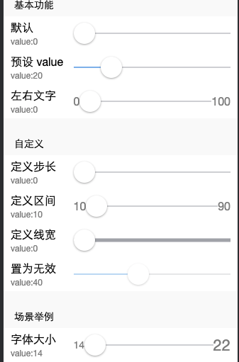
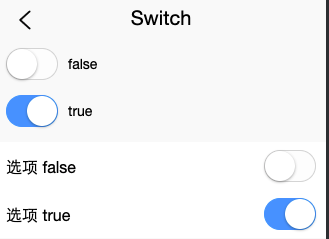
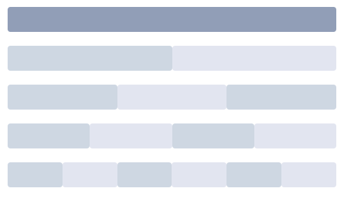
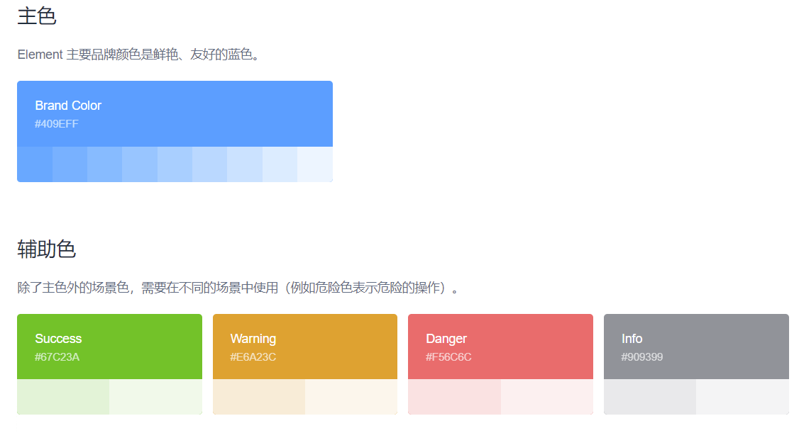
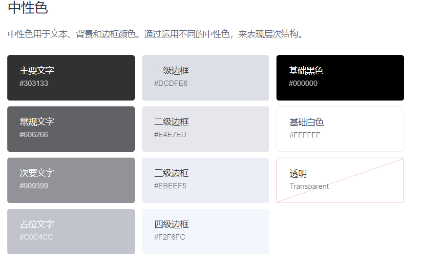

css：bootstrap、layui、zui、amazeui
js：element-ui、miniui

### Vue 
#### 生命周期
`beforeCreate`->`created`->`beforeMount`->`mounted`->`beforeUpdate`->`updated`->`beforeDestroy`->`destroyed`

#### 方法函数
`data`-基础数据，`computed`-计算属性，`methods`-页面方法，`watch`-侦听属性,
```// 数据
data: () => ({
    show: true,
    ...
}),
computed: {
    sunAmt(){
        return this.show?1:0
    },
    now: function () {
        return Date.now()
    }
},
methods: {
    event(e){
        console.log(e);
        this.$el;this.$data
    }
},
watch: {
    msg(newValue, oldValue){// oldValue不用，可省略
        console.log(newValue, oldValue)
    },
    // 另一种
    // msg: {
    //     handler(newValue, oldValue){
    //         console.log(newValue, oldValue);
    //     },
    //     immediate: true
    // }
}

```

#### v-bind:class/v-bind:style 添加类名/内联样式的各种语法
- **对象**
  class:`<div v-bind:class="{ active: isActive }"></div>`
  style:`<div v-bind:style="{ color: activeColor, fontSize: fontSize + 'px' }"></div>`
- **数组**
  class:`<div v-bind:class="[activeClass, errorClass]"></div>`
  根据条件切换列表中的 class，可用三元表达式
  `<div v-bind:class="[isActive ? activeClass : '', errorClass]"></div>`
  style:`<div v-bind:style="[baseStyles, overridingStyles]"></div>`
  >下面这样写只会渲染数组中最后一个被浏览器支持的值。在本例中，如果浏览器支持不带浏览器前缀的 flexbox，那么就只会渲染 display: flex。
  `<div :style="{display:['-webkit-box','-ms-flexbox','flex']}"></div>`

#### 指令
`v-bind:`缩写为`:`,`v-on:`缩写为`@`,
`v-for`
```用在自定义组件上。
// 不自动将 item 注入到组件里的原因是，这会使得组件与 v-for 的运作紧密耦合。明确组件数据的来源能够使组件在其他场合重复使用。
<my-component
  v-for="(item, index) in items"
  v-bind:item="item"
  v-bind:index="index"
  v-bind:key="item.id"
></my-component>
```

#### key管理可复用组件
>Vue 会尽可能高效地渲染元素，通常会复用已有元素而不是从头开始渲染。

如果想让两个元素是完全独立的，不要复用它们。只需添加一个具有唯一值的 key。

#### 事件修饰符
`.stop`-阻止事件继续传播(事件冒泡)
`.prevent`-阻止默认事件
`.capture`-开启事件捕获器，优先在此处理后再交出去
`.self`-本身事件触发，非内部传播事件
`.once`-事件只会触发一次
`.passive`-立即触发默认事件。
>浏览器只有等内核线程执行到事件监听器对应的js代码时，才知道内部是否会调用preventDefault函数来阻止事件默认行为。这种情况下，用户手指事件无法快速产生，导致页面无法快速执行滑动逻辑，显示卡顿效果。
**.passive**就为了告诉浏览器不用查了，直接执行默认动作
```
<!-- 阻止单击事件继续传播 -->
<a v-on:click.stop="doThis"></a>

<!-- 提交事件不再重载页面 -->
<form v-on:submit.prevent="onSubmit"></form>

<!-- 修饰符可以串联 -->
<a v-on:click.stop.prevent="doThat"></a>

<!-- 只有修饰符 -->
<form v-on:submit.prevent></form>

<!-- 添加事件监听器时使用事件捕获模式 -->
<!-- 即内部元素触发的事件先在此处理，然后才交由内部元素进行处理 -->
<div v-on:click.capture="doThis">...</div>

<!-- 只当在 event.target 是当前元素自身时触发处理函数 -->
<!-- 即事件不是从内部元素触发的 -->
<div v-on:click.self="doThat">...</div>
```
使用修饰符时，**顺序很重要**；相应的代码会以同样的顺序产生。因此，用 `v-on:click.prevent.self` 会阻止所有的点击，而 `v-on:click.self.prevent` 只会阻止对元素自身的点击。
```
**2.1.4 新增 once**
<!-- 点击事件将只会触发一次 -->
<a v-on:click.once="doThis"></a>
```
>不像其它只能对原生的 DOM 事件起作用的修饰符，.once 修饰符还能被用到**自定义的组件事件**上。

**2.3.0 新增 passive**
>Vue 还对应 addEventListener 中的 passive 选项提供了 .passive 修饰符。
```
<!-- 滚动事件的默认行为 (即滚动行为) 将会立即触发 -->
<!-- 而不会等待 `onScroll` 完成  -->
<!-- 这其中包含 `event.preventDefault()` 的情况 -->
<div v-on:scroll.passive="onScroll">...</div>
```
>这个 .passive 修饰符尤其能够 **提升移动端的性能**。
**不要把 .passive 和 .prevent 一起使用**，因为 .prevent 将会**被忽略**，同时浏览器可能会向你展示一个警告。请记住，.passive 会告诉浏览器你不想阻止事件的默认行为。

#### 按键修饰符 keyup.修饰符
在监听键盘事件时，我们经常需要检查详细的按键。Vue 允许为 v-on 在监听键盘事件时添加按键修饰符：
```
<!-- 只有在 `key` 是 `Enter` 时调用 `vm.submit()` -->
<input v-on:keyup.enter="submit">
```
`<input v-on:keyup.page-down="onPageDown">`
在上述示例中，处理函数只会在 $event.key 等于 PageDown 时被调用。

**按键码**
>keyCode 的事件用法**已经被废弃**了并可能不会被最新的浏览器支持。

使用 keyCode attribute 也是允许的：
`<input v-on:keyup.13="submit">`
为了在必要的情况下支持旧浏览器，Vue 提供了绝大多数常用的按键码的别名：

`.enter`
`.tab`
`.delete (捕获“删除”和“退格”键)`
`.esc`
`.space`
`.up`
`.down`
`.left`
`.right`
>有一些按键 (.esc 以及所有的方向键) 在 IE9 中有不同的 key 值, 如果你想支持 IE9，这些内置的别名应该是首选。
你还可以通过全局 config.keyCodes 对象自定义按键修饰符别名：
```
// 可以使用 `v-on:keyup.f1`
Vue.config.keyCodes.f1 = 112
```
**系统修饰键**
2.1.0 新增
可以用如下修饰符来实现仅在按下相应按键时才触发鼠标或键盘事件的监听器。

`.ctrl`
`.alt`
`.shift`
`.meta`
>注意：在 Mac 系统键盘上，meta 对应 command 键 (**⌘**)。在 Windows 系统键盘 meta 对应 Windows 徽标键 (**⊞**)。在 Sun 操作系统键盘上，meta 对应实心宝石键 (**◆**)。在其他特定键盘上，尤其在 MIT 和 Lisp 机器的键盘、以及其后继产品，比如 Knight 键盘、space-cadet 键盘，meta 被标记为“META”。在 Symbolics 键盘上，meta 被标记为“META”或者“Meta”。

例如：
```
<!-- Alt + C -->
<input v-on:keyup.alt.67="clear">

<!-- Ctrl + Click -->
<div v-on:click.ctrl="doSomething">Do something</div>
```
请注意修饰键与常规按键不同，在和 keyup 事件一起用时，事件触发时**修饰键必须处于按下状态**。换句话说，只有在按住 ctrl 的情况下释放其它按键，才能触发 keyup.ctrl。而单单释放 ctrl 也不会触发事件。如果你想要这样的行为，请为 ctrl 换用 keyCode：keyup.17。

`.exact` 修饰符
2.5.0 新增
`.exact` 修饰符允许你控制由精确的系统修饰符组合触发的事件。
```
<!-- 即使 Alt 或 Shift 被一同按下时也会触发 -->
<button v-on:click.ctrl="onClick">A</button>

<!-- 有且只有 Ctrl 被按下的时候才触发 -->
<button v-on:click.ctrl.exact="onCtrlClick">A</button>

<!-- 没有任何系统修饰符被按下的时候才触发 -->
<button v-on:click.exact="onClick">A</button>
```
**鼠标按钮修饰符**
2.2.0 新增

`.left`
`.right`
`.middle`
这些修饰符会限制处理函数仅响应特定的**鼠标按钮**。
#### 表单
`.lazy`
在默认情况下，v-model 在每次 input 事件触发后将输入框的值与**数据进行同步** (除了上述输入法组合文字时)。你可以添加 lazy 修饰符，从而转为在 change 事件_之后_进行同步：
```
<!-- 在“change”时而非“input”时更新 -->
<input v-model.lazy="msg">
```
`.number`
如果想自动将用户的**输入值转为数值类型**，可以给 v-model 添加 number 修饰符：
`<input v-model.number="age" type="number">`
这通常很有用，因为即使在 type="number" 时，HTML 输入元素的值也总会返回字符串。如果这个值无法被 parseFloat() 解析，则会返回原始的值。

`.trim`
如果要自动**过滤**用户输入的**首尾空白**字符，可以给 v-model 添加 trim 修饰符：
`<input v-model.trim="msg">`
#### 动态组件 component
有的时候，在不同组件之间进行动态切换是非常有用的，比如在一个多标签的界面里：
上述内容可以通过 Vue 的 <component> 元素加一个特殊的 is attribute 来实现：
```
<!-- 组件会在 `currentTabComponent` 改变时改变 -->
<component v-bind:is="currentTabComponent"></component>
```
在上述示例中，currentTabComponent 可以包括
- 已注册组件的名字，或
- 一个组件的选项对象

#### 组件注册
定义组件名：
1. 当使用 kebab-case (**短横线分隔**命名) 定义一个组件时，你也必须在引用这个自定义元素时使用 kebab-case，例如 `<my-component-name>`。
2. 当使用 PascalCase (**首字母大写**命名) 定义一个组件时，你在引用这个自定义元素时两种命名法都可以使用。也就是说 `<my-component-name>` 和 `<MyComponentName>` 都是可接受的。
>注意，直接在 DOM (即**非字符串的模板**) 中使用时只有 kebab-case 是有效的。

**全局注册**
```
Vue.component('my-component-name', {
  // ... 选项 ...
})
```
**局部注册**
```
var ComponentA = { /* ... */ }
// 然后在 components 选项中定义你想要使用的组件：
new Vue({
  el: '#app',
  components: {
    'component-a': ComponentA
  }
})
```
或者如果你通过 Babel 和 webpack 使用 ES2015 模块，那么代码看起来更像：
```
// 在模块系统中局部注册
import ComponentA from './ComponentA.vue'

export default {
  components: {
    ComponentA
  },
  // ...
}
```
#### props
**命名**
>当你使用 DOM 中的模板时，camelCase (驼峰命名法) 的 prop 名需要使用其等价的 kebab-case (短横线分隔命名) 命名：
**postTitle再html模板中使用post-title表示**
```
Vue.component('blog-post', {
  // 在 JavaScript 中是 camelCase 的
  props: ['postTitle'],
  template: '<h3>{{ postTitle }}</h3>'
})
<!-- 在 HTML 中是 kebab-case 的 -->
<blog-post post-title="hello!"></blog-post>
```
重申一次，如果你使用字符串模板，那么这个限制就不存在了。

**Prop 类型**
以**字符串数组形式**列出的 prop：
`props: ['title', 'likes', 'isPublished', 'commentIds', 'author']`
每个 prop 都有**指定的值类型**。可以以**对象形式**列出 prop，这些 property 的名称和值分别是 prop 各自的名称和类型：
```
props: {
  title: String,
  likes: Number,
  isPublished: Boolean,
  commentIds: Array,
  author: Object,
  callback: Function,
  contactsPromise: Promise // or any other constructor
}
```
>**prop单向数据流**：所有的 prop 都使得其父子 prop 之间形成了一个单向下行绑定：父级 prop 的更新会向下流动到子组件中，但是反过来则不行。这样会防止从子组件意外变更父级组件的状态。
**验证**
为组件的 prop 指定验证要求，如果有一个需求没有被满足，则 Vue 会在浏览器控制台中警告。
```
Vue.component('my-component', {
  props: {
    // 基础的类型检查 (`null` 和 `undefined` 会通过任何类型验证)
    propA: Number,
    // 多个可能的类型
    propB: [String, Number],
    // 必填的字符串
    propC: {
      type: String,
      required: true
    },
    // 带有默认值的数字
    propD: {
      type: Number,
      default: 100
    },
    // 带有默认值的对象
    propE: {
      type: Object,
      // 对象或数组默认值必须从一个工厂函数获取
      default: function () {
        return { message: 'hello' }
      }
    },
    // 自定义验证函数
    propF: {
      validator: function (value) {
        // 这个值必须匹配下列字符串中的一个
        return ['success', 'warning', 'danger'].indexOf(value) !== -1
      }
    }
  }
})
```
当 prop 验证失败的时候，(开发环境构建版本的) Vue 将会产生一个控制台的警告。
#### 自带封装过渡 transition

1. **`<transition>`标签**
一个抽象组件，且只对单个元素生效。(即`<transition>`标签只能用来包裹单元素。) 他有两个属性 **name、mode**
① name 可以理解为class动画的**名字(标识)**
② mode 可以理解为vue提供的动画**过渡模式**（in-out/out-in）
   - in-out：**新元素**先进行过渡，完成之后**当前元素过渡离开**。
   - out-in：**当前元素**先进行过渡，完成之后**新元素过渡进入**

### MintUI
[w3c-MintUI教程链接](https://www.w3cschool.cn/mintui/mintui-lotk35t2.html)
**需要注意的是，样式文件需要单独引入。**
```
import MintUI from 'mint-ui'
import 'mint-ui/lib/style.css'

Vue.use(MintUI)
```
如果你只希望引入部分组件，比如 ​Button​ 和 ​Cell​，那么需要在 main.js 中写入以下内容：
```
import { Button, Cell } from 'mint-ui'

Vue.component(Button.name, Button)
Vue.component(Cell.name, Cell)
/* 或写为
 * Vue.use(Button)
 * Vue.use(Cell)
 */
```
在 Vue 2.0 中，为**自定义组件绑定原生事件必须使用 `​.native​` 修饰符**：
`<my-component @click.native="handleClick">Click Me</my-component>`
从易用性的角度出发，我们对 ​Button​ 组件进行了处理，使它可以监听 ​click​ 事件：
`<mt-button @click="handleButtonClick">Click Me</mt-button>`

#### JS 组件
> 1. **无前缀**-JS中作为对象/方法**直接使用**
> 2. **mt-前缀**HTML中作为**标签使用**
> 3. **v-前缀**HTML标签中作为**属性使用**
##### 1. 简单的消息提示框-Toast | 无前缀
>支持自定义位置、持续时间和样式。

>引入`import { Toast } from 'mint-ui';`

**基本用法**：`Toast('提示信息');`
- 在调用 ​Toast​ 时传入一个对象即可**配置更多**选项
- 若需在文字上方显示一个 icon 图标，可以将**图标的类名**作为​ iconClass ​的值传给 Toast（图标需自行准备）
- 执行​ Toast​ 方法会返回一个 Toast 实例，每个实例都有 ​close​ 方法，用于手动关闭 Toast
```
let instance = Toast({
  message: '提示',
  position: 'bottom',
  duration: 5000,
  iconClass: 'icon icon-success'
});

setTimeout(() => {
  instance.close();
}, 2000);
```
##### Toast: API
- `message`: 文本内容	| String类型 |
- `position`: Toast 的位置 'top','bottom','middle'(默认值) | String类型 |
- `duration`: 持续时间（毫秒），`若为 -1 则不会自动关闭`	3000(默认值) | Number类型 |
- `className`: Toast 的类名。可以为其添加样式 | String类型 |
- `iconClass`: icon 图标的类名 | String类型 |

##### 2. 加载提示框-Indicator(即：loading...转圈圈) | 无前缀
>支持自定义文本和加载图标。

>引入`import { Indicator } from 'mint-ui';`

当需要**显示加载提示框时，调用 open 方法**
`Indicator.open();`
在加载图标下方显示文本
`Indicator.open('加载中...');`
也可以在调用时传入一个对象
```
Indicator.open({
  text: '加载中...',
  spinnerType: 'fading-circle'
});
```
**调用 close 方法将其关闭**
`Indicator.close();`
##### Indicator: API
- `text`:	文本内容 | String |
- `spinnerType`: 加载图标的类型	| 'snake'(默认值) 'fading-circle'，'double-bounce'，'triple-bounce'	 | String |

##### 3. 下拉/上拉刷新-Loadmore | mt-前缀
>支持列表【顶部】和【底部】的**加载提示区域**自定义 HTML 模板。

**引入**
```
import { Loadmore } from 'mint-ui';
Vue.component(Loadmore.name, Loadmore);
// Vue.use(Loadmore)
```
```
<mt-loadmore :top-method="loadTop"// 下拉刷新回调 
  :bottom-method="loadBottom"// 上拉加载回调
  :bottom-all-loaded="allLoaded"// 数据加载完设置为true，默认false
  ref="loadmore">
  <ul>
    <li v-for="item in list">{{ item }}</li>
  </ul>
</mt-loadmore>
```
以列表顶部的下拉刷新为例：`按住列表，下拉一定距离（通过 ​topDistance​ 配置）后释放，被指定为 ​top-method​ 的方法就会执行`
```
loadTop() {
  ...// 加载更多数据
  this.$refs.loadmore.onTopLoaded();
}
```
**注意**在这个方法的最后【需要手动调用 ​loadmore​ 的 ​onTopLoaded​ 事件】。这是因为在加载数据后需要对组件进行一些重新定位的操作。

列表底部的上拉加载与之类似
```
loadBottom() {
  ...// 加载更多数据
  this.allLoaded = true;// 若数据已全部获取完毕
  this.$refs.loadmore.onBottomLoaded();
}
```
唯一的区别是，`当底部数据全部获取完毕时，可以将绑定到组件 ​bottom-all-loaded​ 属性的变量赋值为 ​true​，`这样 ​bottom-method​ 就不会再次执行了。

手指在屏幕上`滑动的距离与组件实际移动的距离比值`可以通过 `​distance-index​` 参数配置，**默认值为 2。**

**自定义 HTML 模板**
可以为列表【顶部】和【底部】的**加载提示区域**提供自定义的 HTML 模板
```
<template>
  <mt-loadmore :top-method="loadTop" @top-status-change="handleTopChange">
    <ul>
      <li v-for="item in list">{{ item }}</li>
    </ul>
    <div slot="top" class="mint-loadmore-top">
      <span v-show="topStatus !== 'loading'" :class="{ 'rotate': topStatus === 'drop' }">↓</span>
      <span v-show="topStatus === 'loading'">Loading...</span>
    </div>
  </mt-loadmore>
</template>
<script>
  export default {
    data() {
      return {
        topStatus: '',
        // ...
      };
    },
    methods: {
      handleTopChange(status) {
        this.topStatus = status;
      },
      // ...
    },
    // ...
  };
</script>
```
比如需要配置列表顶部的 HTML，则需要为自定义 HTML 模板的最外层标签设置 ​slot​ 属性为 ​top​，类名为 ​mint-loadmore-top​。当用户滑动组件时，组件会有以下几个状态：

- ​pull​：组件已经被按下，但按下的距离未达到 topDistance，此时释放不会触发 top-method，列表会回到初始位置
- drop​：按下的距离不小于 topDistance，此时释放会触发 top-method
- loading​：组件已被释放，**top-method 正在执行** 每当组件的状态发生变化时，loadmore都会触发 top-status-change 方法，参数为组件目前的状态。因此可以像本例一样，使用一个 handleTopChange 方法来处理组件状态的变化。

**配置加载提示区域的文字**
在不使用自定义 HTML 模板的情况下，可以配置 loadmore 本身自带的加载提示区域的文字。以列表顶部为例，对应于 ​status​ 的三个状态，可配置的属性依次为 ​`topPullText​`、`​topDropText​` 和 ​`topLoadingText​`。与之对应的底部属性为 ​`bottomPullText​`、​`bottomDropText` ​和 ​`bottomLoadingText`​。

**自动检测**
`loadmore` 在初始化时会自动检测它的高度是否能够撑满其容器，如果不能则会调用 `bottom-method`，直到撑满容器为止。如果不希望使用这一机制，可以将 `auto-fill` 设为 `false`。

##### mt-loadmore: API
- `autoFill`: 是否使`loadmore`自动检测并撑满其容器。默认true填满，即数据不够自动调用加载数据 | Boolean |
- `distanceIndex`: 手指移动与组件移动距离的比值。默认 2 | Number |
- `maxDistance`: 组件可移动的最大距离（像素），若为 0 则不限制	。默认 0 | Number |
- `topPullText`：topStatus 为 pull时加载提示区域的文字。默认：'下拉刷新' | String |
- `topDropText`: topStatus 为 drop时加载提示区域的文字	。默认：'释放更新' | String |
- `topLoadingText`: topStatus 为 `loading` 时加载提示区域的文字。默认：'加载中...'	 | String |
- `topDistance`: 触发 topMethod 的下拉距离阈值（像素）。默认：70 | 	Number |
- `topMethod`: 下拉刷新执行的方法 | Function |
- `bottomPullText`: bottomStatus 为 pull 时加载提示区域的文字	。默认：'上拉刷新' | String |
- `bottomDropText`: bottomStatus 为 drop 时加载提示区域的文字	。默认：'释放更新' | String	|
- `bottomLoadingText`: bottomStatus 为 `loading` 时加载提示区域的文字	。默认：'加载中...' | String |
- `bottomDistance`: 触发 bottomMethod的上拉距离阈值（像素）。默认：70 | Number |
- `bottomMethod`: 上拉刷新执行的方法	| Function |
- `bottomAllLoaded`: 若为真，则 bottomMethod 不会被再次触发	。默认：false | Boolean |
**2. Events**
事件名称	说明	回调参数
- `top-status-change`: 组件顶部状态发生变化时的回调函数, 回调参数`status`-组件顶部的新状态名
- `bottom-status-change`:	组件底部状态发生变化时的回调函数, 回调参数`status`-组件底部的新状态名
**3. Slot**
- `ul-li数据列表`: 数据列表
- `solt='top'`: 自定义顶部加载提示区域 HTML 模板
- `solt='bottom'`:	自定义底部加载提示区域 HTML 模板

##### 4. 无限滚动指令-InfiniteScroll | v-前缀
>无限滚动指令。

**引入**
```
import { InfiniteScroll } from 'mint-ui';
Vue.use(InfiniteScroll);
```
为 HTML 元素添加 `​v-infinite-scroll`​ 指令即可使用无限滚动。滚动该元素，当其底部与被滚动元素底部的距离小于给定的阈值（通过 ​`infinite-scroll-distance`​ 设置）时，绑定到 ​`v-infinite-scroll`​ 指令的方法就会被触发。
```
<ul
  v-infinite-scroll="loadMore"
  infinite-scroll-disabled="loading"
  infinite-scroll-distance="10">
  <li v-for="item in list">{{ item }}</li>
</ul>
loadMore() {
  this.loading = true;
  // 数据处理。
  setTimeout(() => {
    let last = this.list[this.list.length - 1];
    for (let i = 1; i <= 10; i++) {
      this.list.push(last + i);
    }
    this.loading = false;
  }, 2500);
}
```
##### v-infinite-scroll: API
- `infinite-scroll-disabled`:	若为真，则无限滚动不会被触发	。默认：false | Boolean |
- `infinite-scroll-distance`:	触发加载方法的滚动距离阈值（像素）	。默认：0 | Number |
- `infinite-scroll-immediate-check`: 若为真，则指令被绑定到元素上后会立即检查是否需要执行加载方法。在初始状态下内容有可能撑不满容器时十分有用。默认：true | Boolean	 |
- `infinite-scroll-listen-for-event`:	一个 event，被执行时会立即检查是否需要执行加载方法。 |	Function |	

##### 5. 弹出式提示框-MessageBox | 无前缀
>弹出式提示框，有多种交互形式。

>引入:`import { MessageBox } from 'mint-ui';`

以标题与内容字符串为参数进行调用
`MessageBox('提示', '操作成功');`
或者传入一个对象
```
MessageBox({
  title: '提示',
  message: '确定执行此操作?',
  showCancelButton: true
});
```
此外，​MessageBox​ 还提供了​ `alert​、​confirm ​和 ​prompt​` 三个方法，它们都返回一个​ Promise​
```
MessageBox.alert(message, title);
MessageBox.alert('操作成功').then(action => {
  ...
});
MessageBox.confirm(message, title);
MessageBox.confirm('确定执行此操作?').then(action => {
  ...
});
MessageBox.prompt(message, title);
MessageBox.prompt('请输入姓名').then(({ value, action }) => {
  ...
});
```
在 prompt 中，若用户点击了取消按钮，则 Promise 的状态会变为 ​rejected​

##### MessageBox: API
- `title`: 提示框的标题	| String |
- `message`: 提示框的内容	| String |
- `showConfirmButton`: 是否显示确认按钮。默认：true |	Boolean	|
- `showCancelButton`:	是否显示取消按钮。默认：false | Boolean |
- 
- `confirmButtonText`: 确认按钮的文本 |	String |
- `confirmButtonHighlight`:	是否将确认按钮的文本加粗显示。默认：false | Boolean |
- `confirmButtonClass`:	确认按钮的类名 | String |
- 
- `cancelButtonText`: 取消按钮的文本 | String |
- `cancelButtonHighlight`: 是否将取消按钮的文本加粗显示。默认：false | Boolean |
- `cancelButtonClass`: 取消按钮的类名	| String |
- 
- `closeOnClickModal`: 是否在点击遮罩时关闭提示框。默认：true(alert 为 false) |	 Boolean |
- 
- `showInput`: 是否显示一个输入框。默认：false | Boolean |
- `inputType`: 输入框的类型。默认：'text'	| String |
- `inputValue`:	输入框的值 | String |
- `inputPlaceholder`:	输入框的占位符 | String |

##### 6. 操作表-Actionsheet | mt-前缀
>操作表，从屏幕下方移入。

**引入**
```
import { Actionsheet } from 'mint-ui';
Vue.component(Actionsheet.name, Actionsheet);
```
​
- `actions`​ 属性绑定一个由对象组成的数组，每个对象有 ​`name`​ 和 `​method`​ 两个键，`​name`​ 为菜单项的文本，​`method`​ 为点击该菜单项的回调函数。
- 将​ `v-model` ​绑定到一个本地变量，通过操作这个变量即可控制 ​`actionsheet​` 的显示与隐藏。
```
<mt-actionsheet
  :actions="actions"
  v-model="sheetVisible">
</mt-actionsheet>
/**
  actions:[
    {name:'选项一',method:callback1},
    {name:'选项二',method:callback2},
    {name:'选项三',method:callback3}
  ]
  */
```
##### mt-actionsheet: API
- `actions`: 菜单项数组 |	Array |
- `cancelText`:	取消按钮的文本。若设为空字符串，则不显示取消按钮。默认：'取消' |	String |
- `closeOnClickModal`: 是否可以通过点击 modal 层来关闭 actionsheet	。默认：true | Boolean |

##### 7. 弹出框-Popup | mt-前缀
>弹出框，可自定义内容。

**引入**
```
import { Popup } from 'mint-ui';
Vue.component(Popup.name, Popup);
```
- `position` 属性指定了 popup 的位置。比如，position 为 'bottom' 时，popup 会从屏幕下方移入，并最终固定在屏幕下方。移入/移出的动效会根据 position 的不同而自动改变，无需手动配置。
- 将 `v-model` 绑定到一个本地变量，通过操作这个变量即可控制 popup 的显示与隐藏。
```
<mt-popup
  v-model="popupVisible"
  position="bottom">
  ...
</mt-popup>
```
若省略 position 属性，则 popup 会相对于屏幕**居中显示**（若不想让其居中，可通过 CSS 对其重新定位）。此时建议将动效设置为 popup-fade，这样在显示/隐藏时会有淡入/淡出效果。
```
<mt-popup
  v-model="popupVisible"
  popup-transition="popup-fade">
  ...
</mt-popup>
```
##### mt-popup: API
- `position`:	popup 的位置。省略则居中显示 | String | 'top','right','bottom','left'
- `pop-transition`:	显示/隐藏时的动效，**仅在省略 position 时可配置** |	String | 'popup-fade'
- `modal`: 是否创建一个 modal 层 | Boolean | 默认：true
- `closeOnClickModal`: 是否可以通过点击 modal 层来关闭 popup	 | Boolean | 默认：true

**Slot**
-	弹出框的内容

下面是一个从左侧弹出的实例：
```
// html
<!-- 引入样式 -->
<link rel="stylesheet" href="https://unpkg.com/mint-ui/lib/style.css" rel="external nofollow" target="_blank" >


<mt-button @click.native="handleClick">按钮</mt-button>

<mt-popup v-model="popupVisible" position="left" modal=false>

<child> </child>

</mt-popup>

<!-- 先引入 Vue -->
<script src="https://unpkg.com/vue/dist/vue.js" rel="external nofollow" ></script>
<!-- 引入组件库 -->
<script src="https://unpkg.com/mint-ui/lib/index.js" rel="external nofollow" ></script>

// script
new Vue({
  el: '#app',
  data: {
    popupVisible: false
  },
  methods: {
    handleClick: function () {
      this.popupVisible = true
    }
  },
  components: {
    child: {
      template: "<h1>w3cschool</h1>"
    }
  }
})
```

##### 8. 轮播图 - Swipe, SwipeItem | mt-前缀
>轮播图，可自定义轮播时间间隔、动画时长等。

**引入**
```
import { Swipe, SwipeItem } from 'mint-ui';

Vue.component(Swipe.name, Swipe);
Vue.component(SwipeItem.name, SwipeItem);
```
**基础用法**
```
<mt-swipe :auto="4000">
  <mt-swipe-item>1</mt-swipe-item>
  <mt-swipe-item>2</mt-swipe-item>
  <mt-swipe-item>3</mt-swipe-item>
</mt-swipe>
```
**隐藏​ indicators**
`<mt-swipe :show-indicators="false">`​
**取消自动播放**
`<mt-swipe :auto="0">`
**change 事件**
轮播图切换时会触发 ​change​ 事件，参数为切入轮播图的索引
```
<mt-swipe @change="handleChange">
  <mt-swipe-item>1</mt-swipe-item>
  <mt-swipe-item>2</mt-swipe-item>
  <mt-swipe-item>3</mt-swipe-item>
</mt-swipe>
methods: {
  handleChange(index) {
    ...
  }
}
```
##### mt-swipe: API
- `speed`: 动画持时（毫秒）| Number | 默认：300
- `auto`: 自动播放的时间间隔（毫秒）| Number | 默认：3000
- `defaultIndex`:	初始显示的轮播图的索引 | Number | 默认：0
- `continuous`:	是否可以循环播放 | Boolean | 默认：true
- `showIndicators`:	是否显示​ indicators |​	Boolean | true
- `prevent`: 是否在 ​touchstart ​事件触发时阻止事件的默认行为。设为​ true​ 可提高运行在低版本安卓浏览器时的性能 |	 Boolean | 默认：false
- `stopPropagation`: 是否在 ​touchstart ​事件触发时阻止冒泡。	| Boolean | 默认：false

**Slot**
在`mt-swipe`中 -	一个或多个 mt-swipe-item 组件
在`mt-swipe-item`中 -	单个轮播图的内容

##### 9. 图片懒加载指令-Lazyload | v-前缀
>图片懒加载指令。
**引入**
```
import { Lazyload } from 'mint-ui';

Vue.use(Lazyload);
```
为​ img​ 元素**添加 ​v-lazy​ 指令**，指令的值为**图片的地址**。同时需要设置图片在**加载时的样式**。
```
<ul>
  <li v-for="item in list">
    
  </li>
</ul>
image[lazy=loading] {// 属性选择器。当lazy==loading时应用
  width: 40px;
  height: 300px;
  margin: auto;
}
```
若列表不在 ​window ​上滚动，则需要将被滚动元素的 ​id​ 属性以修饰符的形式传递给​ v-lazy​指令
```
<div id="container">
  <ul>
    <li v-for="item in list">
      
    </li>
  </ul>
</div>
```

##### 10. 滑块-Range | mt-前缀
>滑块，支持自定义步长、区间等。


**引入**
```
import { Range } from 'mint-ui';

Vue.component(Range.name, Range);
```
将一个本地变量与 ​range​ 的 ​value​ 属性同步即可实现双向绑定
`<mt-range v-model="rangeValue"></mt-range>`
更多的配置项
```
<mt-range
  v-model="rangeValue"
  :min="10"
  :max="90"
  :step="10"
  :bar-height="5">
</mt-range>
```
可在滑块两侧显示文字
```
<mt-range v-model="rangeValue">
  <div slot="start">0</div>
  <div slot="end">100</div>
</mt-range>
```
##### mt-range: API
- `v-model`: `rangeValue`-滑块的值 | Number |
- `min`: 最小值 | Number | 默认：0
- `max`: 最大值	| Number | 默认: 100
- `step`:	步长 | Number | 默认：1
- `disabled`:	是否禁用 | Boolean | 默认：false
- `barHeight`: 滑槽的线宽（像素）| Number | 默认：1

**Slot**
- `slot='start'`	滑块左侧 DOM
- `slot='end'`	滑块右侧 DOM

##### 11. 进度条-Progress | mt-前缀
>进度条。

**引入**
```
import { Progress } from 'mint-ui';

Vue.component(Progress.name, Progress);
```
传入​ value​ 作为进度条的值。可自定义它的线宽
`<mt-progress :value="20" :bar-height="5"></mt-progress>`
可在进度条两侧显示文字
```
<mt-progress :value="60">
  <div slot="start">0%</div>
  <div slot="end">100%</div>
</mt-progress>
```
##### mt-progress: API
- `value`: 进度条的值（%）| Number		
- `barHeight`: 进度条的线宽（像素）| Number |	默认：1

**Slot**
- `slot='start'`	滑块左侧 DOM
- `slot='end'`	滑块右侧 DOM

##### 12. 选择器-Picker | mt-前缀
>选择器，支持多 slot 联动。
**引入**
```
import { Picker } from 'mint-ui';

Vue.component(Picker.name, Picker);
```
传入 ​slots​，当被选中的值发生变化时触发 ​change​ 事件。​change​ 事件有两个参数，分别为当前​ picker​ 的 ​vue​ 实例和各 ​slot ​被选中的值组成的数组
```
<!-- 引入样式 -->
<link rel="stylesheet" href="https://unpkg.com/mint-ui/lib/style.css" rel="external nofollow" target="_blank" >

<mt-picker :slots="slots" @change="onValuesChange"></mt-picker>

<!-- 先引入 Vue -->
<script src="https://unpkg.com/vue/dist/vue.js" rel="external nofollow" ></script>

<!-- 引入组件库 -->
<script src="https://unpkg.com/mint-ui/lib/index.js" rel="external nofollow" ></script>

new Vue({
  el: '#app',
  methods: {
    onValuesChange(picker, values) {
      if (values[0] > values[1]) {
        picker.setSlotValue(1, values[0]);
      }
    }
  },
  data() {
    return {
      slots: [
        {
          flex: 1,
          values: ['2020-01', '2020-02', '2020-03', '2020-04', '2020-05', '2020-06', '2020-07', '2020-08', '2020-09', '2020-10', '2020-11', '2020-12'],
          className: 'slot1',
          textAlign: 'right'
        }, {
          divider: true,
          content: '-',
          className: 'slot2'
        }, {
          flex: 1,
          values: ['2020-01', '2020-02', '2020-03', '2020-04', '2020-05', '2020-06', '2020-07', '2020-08', '2020-09', '2020-10', '2020-11', '2020-12'],
          className: 'slot3',
          textAlign: 'left'
        }
      ]
    };
  }
})
```
**change 事件**
在 change 事件中，可以使用注册到 picker 实例上的一些方法：
- `​getSlotValue(index)`​：获取给定 slot 目前被选中的值
- `​setSlotValue(index, value)`​：设定给定 slot 被选中的值，该值必须存在于该 slot 的备选值数组中
- `​getSlotValues(index)`​：获取给定 slot 的备选值数组
- `​setSlotValues(index, values)​`：设定给定 slot 的备选值数组
- `​getValues()`​：获取所有 slot 目前被选中的值（分隔符 slot 除外）
- `​setValues(values)`​：设定所有 slot 被选中的值（分隔符 slot 除外），该值必须存在于对应 slot 的备选值数组中

**slots**
绑定到​ slots ​属性的数组由对象组成，每个对象都对应一个 ​slot​，它们有如下键名
- `divider`: 对应 slot 是否为分隔符
- `content`: 分隔符 slot 的显示文本
- `values`:	对应 slot 的备选值数组。若为对象数组，则需在 mt-picker 标签上设置 value-key属性来指定显示的字段名
- `defaultIndex`:	对应 slot 初始选中值，需传入其在 values 数组中的序号，默认为 0
- `textAlign`: 对应 slot 的对齐方式
- `flex`:	对应 slot CSS 的 flex 值
- `className`:	对应 slot 的类名
##### mt-picker: API
- `slots`: slot 对象数组 | Array | []
- `valueKey`:	当 values 为对象数组时，作为文本显示在 Picker 中的对应字段的字段名	 | String | '' 
- `showToolbar`: 是否在组件顶部显示一个 toolbar，内容自定义 | Boolean | false
- `visibleItemCount`:	slot 中可见备选值的个数	|Number | 5
- `itemHeight`:	每个 slot 的高度 | Number | 36

**Slot** -	当 `showToolbar` 为 true 时，`toolbar` 中的内容。

##### 13. 日期时间选择器-DatetimePicker | mt-前缀
>日期时间选择器，支持自定义类型。

**引入**
```
import { DatetimePicker } from 'mint-ui';

Vue.component(DatetimePicker.name, DatetimePicker);
```
- `​v-model`​ 属性为组件的绑定值。
- `​type`​ 属性表示 ​datetime-picker​ 组件的类型，它有三个可能的值：
  - 'datetime'​: 日期时间选择器，可选择**年、月、日、时、分**，value 值为一个 Date 对象
  - 'date': 日期选择器，可选择**年、月、日**，value 值为一个 Date 对象
  - '​time'​: 时间选择器，可选择**时、分**，value 值为一个格式为 HH:mm 的字符串

**mt-datetime-picker**: ​提供了两个供外部调用的方法：​**open ​和 ​close**​，分别用于打开和关闭选择器。
```
<template>
  <mt-datetime-picker
    ref="picker"
    type="time"
    v-model="pickerValue">
  </mt-datetime-picker>
</template>

<script>
  export default {
    methods: {
      openPicker() {
        this.$refs.picker.open();
      }
    }
  };
</script>
```
可以为选项提供自定义模板。模板须为一个包含了 ​{value}​ 的字符串，​{value}​ 会被解析为相应选项的值。
```
<mt-datetime-picker
  v-model="pickerVisible"
  type="date"
  year-format="{value} 年"
  month-format="{value} 月"
  date-format="{value} 日">
</mt-datetime-picker>
```
当点击确认按钮时会触发 **​confirm​ 事件**，参数为当前 ​value​ 的值。
```
<mt-datetime-picker
  v-model="pickerVisible"
  type="time"
  @confirm="handleConfirm">
</mt-datetime-picker>
```
##### mt-datetime-picker: API
- `type`:	组件的类型 | String	| 'datetime'(默认), 'date', 'time'
- `cancelText`:	取消按钮文本 | String | '取消'
- `confirmText`: 确定按钮文本	| String | '确定'
- `startDate`: 日期的最小可选值	| Date | 十年前的 1 月 1 日
- `endDate`: 日期的最大可选值	| Date | 十年后的 12 月 31 日
- `startHour`: 小时的最小可选值	| Number | 0
- `endHour`: 小时的最大可选值	| Number | 23
- `yearFormat`:	年份模板 | String | '{value}'
- `monthFormat`: 月份模板	| String | '{value}'
- `dateFormat`:	日期模板 | String | '{value}'
- `hourFormat`:	小时模板 | String |	'{value}'
- `minuteFormat`:	分钟模板 | String | '{value}'

**Events**
- `confirm`	点击确认按钮时的回调函数 | 目前的选择值

##### 14. 索引列表-IndexList,IndexSection | mt-前缀
>索引列表，可由右侧索引导航快速定位到相应的内容。

**引入**
```
import { IndexList, IndexSection } from 'mint-ui';

Vue.component(IndexList.name, IndexList);
Vue.component(IndexSection.name, IndexSection);
```
```
<mt-index-list>
  <mt-index-section index="A">
    <mt-cell title="Aaron"></mt-cell>
    <mt-cell title="Alden"></mt-cell>
    <mt-cell title="Austin"></mt-cell>
  </mt-index-section>
  <mt-index-section index="B">
    <mt-cell title="Baldwin"></mt-cell>
    <mt-cell title="Braden"></mt-cell>
  </mt-index-section>
  ...
  <mt-index-section index="Z">
    <mt-cell title="Zack"></mt-cell>
    <mt-cell title="Zane"></mt-cell>
  </mt-index-section>
</mt-index-list>
```
**`​mt-index-section`**:​ 与右侧导航中的索引一一对应，​`mt-index-section`​ 的 ​index ​属性即为与其对应的索引的显示文本。`​mt-index-section`​ 标签内可为任意自定义内容。

当手指在右侧导航中滑动时，会在列表中间显示一个目前索引值的提示符。若**不需要提示符**，只需将 ​`show-indicator​`设为 ​false​
```
<mt-index-list :show-indicator="false">
  ...
</mt-index-list>
```
##### mt-index-list: API
mt-index-list
- `height`	组件的高度。若不指定，则自动延伸至视口底	Number
- `showIndicator`	是否显示索引值提示符	Boolean		true

mt-index-section
- `index`	索引值（必需参数）	String		

**Slot**
- `mt-index-list` -	一个或多个 mt-index-section 组件
- `mt-index-section` -	单个 mt-index-section 的内容

##### 15. 调色板按钮-PaletteButton | mt-前缀
>调色板按钮

**引入**
```
import { PaletteButton } from 'mint-ui';

Vue.component(PaletteButton.name, PaletteButton);
```
**基本用法**
```
<mt-palette-button content="+">
  <div class="my-icon-button"></div>
  <div class="my-icon-button"></div>
  <div class="my-icon-button"></div>
</mt-palette-button>
```
设置参数和事件，以及手动触发事件
```
methods: {
  main_log(val) {
    console.log('main_log', val);
  },
  sub_log(val) {
    console.log('sub_log', val);
    this.$refs.target_1.collapse();
  }
}
<mt-palette-button
  content="+"
  @expand="main_log('expand')" 
  @expanded="main_log('expanded')" 
  @collapse="main_log('collapse')"
  direction="rt"
  class="pb"
  :radius="80" 
  ref="target_1" 
  mainButtonStyle="color:#fff;
  background-color:#26a2ff;"
  style="left:30px;">
    <div class="my-icon-button indexicon icon-popup" @touchstart="sub_log(1)"></div>
    <div class="my-icon-button indexicon icon-popup" @touchstart="sub_log(2)"></div>   
    <div class="my-icon-button indexicon icon-popup" @touchstart="sub_log(3)"></div>
</mt-palette-button>
```
##### mt-palette-button: API
- `content`	主按钮内容 | String |
- `offset`	角度偏移量 | Number | Math.PI / 4
- `direction`	按钮展开方向 | String | ​lt(默认)​, ​t​, ​rt​, ​r​, ​rb​, ​b​, ​lb​, ​l​	
- `radius`	按钮展开半径 | Number | 90
- `mainButtonStyle`	主按钮样式 | String		

**方法**
- `toggle`	切换按钮展开/收起状态
- `expand`	展开按钮
- `collapse`	收起按钮
**事件**
- `expand`	按钮开始展开
- `expanded`	按钮完全展开（动画效果执行结束）
- `collapse`	按钮开始收起

#### CSS组件
##### 1. 顶部导航栏-Header | mt-前缀
>顶部导航栏，支持显示按钮、自定义文字和固定在顶部。

**引入**
```
import { Header } from 'mint-ui';

Vue.component(Header.name, Header);
```
固定在页面顶部
`<mt-header fixed title="固定在顶部"></mt-header>`
设置 ​left ​或 ​right slot​
```
<mt-header title="标题过长会隐藏后面的内容啊哈哈哈哈">
  <router-link to="/" slot="left">
    <mt-button icon="back">返回</mt-button>
  </router-link>
  <mt-button icon="more" slot="right"></mt-button>
</mt-header>
```
设置多个按钮
```
<mt-header title="多个按钮">
  <router-link to="/" slot="left">
    <mt-button icon="back">返回</mt-button>
    <mt-button @click="handleClose">关闭</mt-button>
  </router-link>
  <mt-button icon="more" slot="right"></mt-button>
</mt-header>
```
##### mt-header: API
- `fixed`	固定在页面顶部 | Boolean | false
- `title`	标题 | String |
**Slot**
- `left`	左边显示元素
- `right`	右边显示元素
- 
##### 2. 底部选项卡-Tabbar,TabItem | mt-前缀
>底部选项卡，点击 tab 会切换显示的页面。依赖 tab-item 组件。

**引入**
```
import { Tabbar, TabItem } from 'mint-ui';

Vue.component(Tabbar.name, Tabbar);
Vue.component(TabItem.name, TabItem);
```
搭配 tab-container 组件使用
```
<mt-tabbar v-model="selected">
  <mt-tab-item id="外卖">
    
    外卖
  </mt-tab-item>
  <mt-tab-item id="订单">
    
    订单
  </mt-tab-item>
  <mt-tab-item id="发现">
    
    发现
  </mt-tab-item>
  <mt-tab-item id="我的">
    
    我的
  </mt-tab-item>
</mt-tabbar>
```
##### mt-tabbar: API
**tabbar**
- `fixed`	固定在页面底部 | Boolean | false
- `value`	返回当前选中的 tab-item 的 id

**tab-item**
- `id`	选中后的返回值

**Slot**
- `tabbar` -	内容
- `tab-item` -	显示文字, `icon` - icon 图标

##### 3. 顶部选项卡-Navbar,TabItem | mt-前缀
>顶部选项卡，与 ​Tabbar​ 类似，依赖​ tab-item ​组件。

**引入**
```
import { Navbar, TabItem } from 'mint-ui';

Vue.component(Navbar.name, Navbar);
Vue.component(TabItem.name, TabItem);
```
搭配 tab-container 组件使用
```
<mt-navbar v-model="selected">
  <mt-tab-item id="1">选项一</mt-tab-item>
  <mt-tab-item id="2">选项二</mt-tab-item>
  <mt-tab-item id="3">选项三</mt-tab-item>
</mt-navbar>

<!-- tab-container -->
<mt-tab-container v-model="selected">
  <mt-tab-container-item id="1">
    <mt-cell v-for="n in 10" :title="'内容 ' + n" />
  </mt-tab-container-item>
  <mt-tab-container-item id="2">
    <mt-cell v-for="n in 4" :title="'测试 ' + n" />
  </mt-tab-container-item>
  <mt-tab-container-item id="3">
    <mt-cell v-for="n in 6" :title="'选项 ' + n" />
  </mt-tab-container-item>
</mt-tab-container>
```
##### mt-navbar: API
**navbar**
- `fixed`	固定在页面顶部	Boolean		false
- `value`	返回当前选中的 tab-item 的 id	*		

**tab-item**
- `id`	选中后的返回值	*		

**Slot**
`navbar` -	内容
`tab-item` -	显示文字, `icon`-icon 图标

##### 4. 按钮-Button | mt-前缀
>按钮，提供几种基础样式和尺寸，可自定义图标。

**引入**
```
import { Button } from 'mint-ui';

Vue.component(Button.name, Button);
```
**改变颜色**
```
<mt-button type="default">default</mt-button>
<mt-button type="primary">primary</mt-button>
<mt-button type="danger">danger</mt-button>
```
**改变大小**
```
<mt-button size="small">small</mt-button>
<mt-button size="large">large</mt-button>
<mt-button size="normal">normal</mt-button>
```
**禁用按钮**
`<mt-button disabled>disabled</mt-button>`
**幽灵按钮**
`<mt-button plain>plain</mt-button>`
**带图标**
```
<mt-button icon="back">back</mt-button>
<mt-button icon="more">更多</mt-button>
```
**自定义图标**
```
<mt-button>
  
  带自定义图标
</mt-button>
```
**绑定 ​click​ 事件**
`<mt-button @click.native="handleClick">点击触发 handleClick</mt-button>`
##### mt-button: API
- `plain`	幽灵按钮 | Boolean | false
- `disabled`	禁用状态 | Boolean | false
- `type`	按钮显示样式 | String | default(默认), primary, danger
- `size`	尺寸 | String | small, normal(默认), large
- `icon`	图标 | String |	more, back	

**Slot**
-	显示的文本内容,`icon`-自定义显示的图标

##### 5. 单元格-Cell | mt-前缀
>单元格，可用作展示列表信息、链接或者表单等。

**引入**
```
import { Cell } from 'mint-ui';

Vue.component(Cell.name, Cell);
```
**基础用法**
```
<mt-cell title="标题文字"></mt-cell>
<mt-cell title="标题文字" value="说明文字"></mt-cell>
```
**可点击的链接**
```
<mt-cell
  title="标题文字"
  to="//github.com"
  is-link
  value="带链接">
</mt-cell>
```
**带图标**
`<mt-cell title="标题文字" icon="more" value="带 icon"></mt-cell>`
**带自定义图标**
```
<mt-cell title="标题文字">
  <span>icon 是图片</span>
  
</mt-cell>
```
**自定义内容**
```
<mt-cell title="标题文字" is-link>
  <span style="color: green">这里是元素</span>
</mt-cell>
```
**带备注信息**
`<mt-cell title="标题" label="描述信息" is-link></mt-cell>`
##### mt-cell: API
- `icon`	图标 | String |	back, more	
- `title`	标题 | String	|
- `to`	跳转链接 | String |
- `value`	内容
- `label`	备注信息，显示在标题下方 | String |
- `is-link`	链接，会显示箭头图标。搭配 to 属性使用	| Boolean |

**Slot**
-	自定义显示内容
- `title`	自定义标题
- `icon`	自定义图标
##### 6. 可滑动的单元格-CellSwipe | mt-前缀
>可滑动的单元格，用法同 ​cell​。

**引入**
```
import { CellSwipe } from 'mint-ui';

Vue.component(CellSwipe.name, CellSwipe);
```

**增加右滑动按钮**
```
<mt-cell-swipe
  title="标题文字"
  :right="[
    {
      content: 'Delete',
      style: { background: 'red', color: '#fff' },
      handler: () => this.$messagebox('delete')
    }
  ]"></mt-cell-swipe>
```
`content`​ 可以是 ​HTML​ 或者纯文本。

##### mt-cell-swipe: API
- icon	图标	String	back, more	
- title	标题	String		
- to	跳转链接	String		
- value	内容	*		
- label	备注信息，显示在标题下方	String		
- is-link	链接，会显示箭头图标。搭配 to 属性使用	Boolean		
- left	按钮组, { content, style, handler }	Object[]		
- right	按钮组, { content, style, handler }	Object[]		

**Slot**
-	自定义显示内容, `title`	自定义标题, `icon`	自定义图标
##### 7. 加载动画-Spinner | mt-前缀
>加载动画，可指定显示类型、尺寸和颜色。

**引入**
```
import { Spinner } from 'mint-ui';

Vue.component(Spinner.name, Spinner);
```
指定类型
```
<mt-spinner type="snake"></mt-spinner>
<mt-spinner type="double-bounce"></mt-spinner>
<mt-spinner type="triple-bounce"></mt-spinner>
<mt-spinner type="fading-circle"></mt-spinner>

<!-- 或者接受传入类型的序号 -->
<mt-spinner :type="0"></mt-spinner>
<mt-spinner :type="1"></mt-spinner>
<mt-spinner :type="2"></mt-spinner>
<mt-spinner :type="3"></mt-spinner>
```
指定颜色
```
<mt-spinner color="#26a2ff"></mt-spinner>
<mt-spinner color="rgb(100, 100, 100)"></mt-spinner>
<mt-spinner color="yellow"></mt-spinner>
```
指定尺寸
`<mt-spinner :size="60"></mt-spinner>`
##### mt-spinner: API
参数	说明	类型	可选值	默认值
- type	显示类型，提供四种风格，可以指定名称或者序号 | String、Number | snake(默认)，double-bounce，triple-bounce，fading-circle	
- color	颜色，接受 hex、rgb 等颜色值	String		#ccc
- size	尺寸，单位 px	Number		28
##### 8. 面板- TabContainer,TabContainerItem | mt-前缀
>面板，可切换显示子页面。

引入
```
import { TabContainer, TabContainerItem } from 'mint-ui';

Vue.component(TabContainer.name, TabContainer);
Vue.component(TabContainerItem.name, TabContainerItem);
```
改变 ​ative​ 的值，与 `​<tab-container-item>​ `的​ id​ 一致即显示对应页面。
```
<mt-tab-container v-model="active">
  <mt-tab-container-item id="tab-container1">
    <mt-cell v-for="n in 10" title="tab-container 1"></mt-cell>
  </mt-tab-container-item>
  <mt-tab-container-item id="tab-container2">
    <mt-cell v-for="n in 5" title="tab-container 2"></mt-cell>
  </mt-tab-container-item>
  <mt-tab-container-item id="tab-container3">
    <mt-cell v-for="n in 7" title="tab-container 3"></mt-cell>
  </mt-tab-container-item>
</mt-tab-container>
```
##### tab-container: API
tab-container
- value	当前激活的 id	*		
- swipeable	显示滑动效果	Boolean		false

tab-container-item
- id	item 的 id	*		

Slot
- `tab-container` -	内容
- `tab-container-item` -	内容
##### 9. 搜索框-Search | mt-前缀
>搜索框，可显示搜索结果列表。

引入
```
import { Search } from 'mint-ui';

Vue.component(Search.name, Search);
```
基础用法
`<mt-search v-model="value"></mt-search>`
设置显示文字
```
<mt-search
  v-model="value"
  cancel-text="取消"
  placeholder="搜索">
</mt-search>
```
带搜索结果
`<mt-search v-model="value" :result.sync="result"></mt-search>`
自定义搜索结果
```
<mt-search v-model="value">
  <mt-cell
    v-for="item in result"
    :title="item.title"
    :value="item.value">
  </mt-cell>
</mt-search>
```
##### mt-search: API
- value	搜索结果绑定值	String		
- cancel-text	取消按钮文字	String		取消
- placeholder	搜索框占位内容	String		搜索
- result	搜索结果列表	Array		
- autofocus	自动聚焦	Boolean	-	false
- show	始终显示搜索列表	Boolean	-	false

**Slot** -	自定义搜索结果列表

#### Form 组件
##### 1. 开关-Switch | mt-前缀
>开关。


**引入**
```
import { Switch } from 'mint-ui';

Vue.component(Switch.name, Switch);
```
`<mt-switch v-model="value"></mt-switch>`
带显示内容
`<mt-switch v-model="value">开关</mt-switch>`
##### mt-switch: API
- `value`	绑定值	Boolean		

**Event** - `change` 返回值-`checked:Boolean`
**Slot** -	显示内容
##### 2. 复选框列表-Checklist | mt-前缀
>复选框列表，依赖​ cell ​组件。
引入
```
import { Checklist } from 'mint-ui';

Vue.component(Checklist.name, Checklist);
```
基本用法
```
<mt-checklist
  title="复选框列表"
  v-model="value"
  :options="['选项A', '选项B', '选项C']">
</mt-checklist>
```
设置禁用选项
```
this.options = [
  {
    label: '被禁用',
    value: '值F',
    disabled: true
  },
  {
    label: '选中禁用',
    value: '选中禁用的值',
    disabled: true
  },
  {
    label: '选项A',
    value: '值A'
  },
  {
    label: '选项B',
    value: '值B'
  }
];
<mt-checklist
  v-model="value"
  :options="options">
</mt-checklist>
```
设置最大可选数
```
<mt-checklist
  :max="2"
  v-model="value"
  :options="options">
</mt-checklist>
```
选择框右对齐
```
<mt-checklist
  align="right"
  title="右对齐"
  v-model="value"
  :options="options">
</mt-checklist>
```
##### mt-cheklist: API
- options	选择项，可直接传字符串数组或者对象数组	Array		
- value	绑定值	Array		
- title	标题，显示在列表上方	string		
- max	最多可选个数，超过后其他未选择的选项变成禁用状态	Number		
- align	复选框对其位置	String	left, right	left

##### 3. 单选框列表-Radio | mt-前缀
>单选框列表，依赖 ​cell​ 组件。

引入
```
import { Radio } from 'mint-ui';

Vue.component(Radio.name, Radio);
```
基本用法
```
<mt-radio
  title="单选框列表"
  v-model="value"
  :options="['选项A', '选项B', '选项C']">
</mt-radio>
```
设置禁用选项
```
this.options = [
  {
    label: '被禁用',
    value: '值F',
    disabled: true
  },
  {
    label: '选项A',
    value: '值A'
  },
  {
    label: '选项B',
    value: '值B'
  }
];
<mt-radio
  title="单选框列表"
  v-model="value"
  :options="options">
</mt-radio>
```
单选框右对齐
```
<mt-radio
  align="right"
  title="右对齐"
  v-model="value"
  :options="options">
</mt-radio>
```
##### mt-radio: API
参数	说明	类型	可选值	默认值
- options	选择项	Array		
- value	绑定值	String		
- title	标题，显示在列表上方	string		
- align	单选框对其位置	String	left, right	left
##### 4. 表单编辑器-Field | mt-前缀
>表单编辑器。

引入
```
import { Field } from 'mint-ui';

Vue.component(Field.name, Field);
```
基础用法
```
<mt-field label="用户名" placeholder="请输入用户名" v-model="username"></mt-field>
<mt-field label="邮箱" placeholder="请输入邮箱" type="email" v-model="email"></mt-field>
<mt-field label="密码" placeholder="请输入密码" type="password" v-model="password"></mt-field>
<mt-field label="手机号" placeholder="请输入手机号" type="tel" v-model="phone"></mt-field>
<mt-field label="网站" placeholder="请输入网址" type="url" v-model="website"></mt-field>
<mt-field label="数字" placeholder="请输入数字" type="number" v-model="number"></mt-field>
<mt-field label="生日" placeholder="请输入生日" type="date" v-model="birthday"></mt-field>
<mt-field label="自我介绍" placeholder="自我介绍" type="textarea" rows="4" v-modal="introduction"></mt-field>
```
设置校验状态
```
<mt-field label="邮箱" state="success" v-model="email"></mt-field>
<mt-field label="邮箱" state="error" v-model="email"></mt-field>
<mt-field label="邮箱" state="warning" v-model="email"></mt-field>
```
自定义内容（例如添加验证码）
```
<mt-field label="验证码" v-model="captcha">
  
</mt-field>
```
##### mt-field: API
参数	说明	类型	可选值	默认值
- type	输入框类型	String	text(默认), number, email, url, tel, date, datetime, password, textarea
- label	标签	String		
- value	绑定表单输入值	String		
- rows	类型为 textarea 时可指定高度（显示行数）	Number		
- placeholder	占位内容	String		
- disableClear	禁用 clear 按钮	Booean		false
- readonly	readonly	Boolean		false
- disabled	disabled	Boolean		false
- state	校验状态	String	error, success, warning	
- attr	设置原生属性，例如 :attr="{ maxlength: 10 }"	Object		

**Slot** -	显示的 HTML 内容

### Element UI
[Element UI官网](https://element.eleme.cn/#/zh-CN/component/container)
**注意样式文件需要单独引入**
1. **全局全量引入**
```
import ElementUI from 'element-ui';
Vue.use(ElementUI);
// 需要注意的是，样式文件需要单独引入。
import 'element-ui/lib/theme-chalk/index.css';
```
2. **引入部分组件**
```
import { Button, Select } from 'element-ui';
Vue.component(Button.name, Button);
Vue.component(Select.name, Select);
/* 或写为
 * Vue.use(Button)
 * Vue.use(Select)
 */
```
```
import {
  Pagination,
  Dialog,
  Autocomplete,
  Dropdown,
  DropdownMenu,
  DropdownItem,
  Menu,
  Submenu,
  MenuItem,
  MenuItemGroup,
  Input,
  InputNumber,
  Radio,
  RadioGroup,
  RadioButton,
  Checkbox,
  CheckboxButton,
  CheckboxGroup,
  Switch,
  Select,
  Option,
  OptionGroup,
  Button,
  ButtonGroup,
  Table,
  TableColumn,
  DatePicker,
  TimeSelect,
  TimePicker,
  Popover,
  Tooltip,
  Breadcrumb,
  BreadcrumbItem,
  Form,
  FormItem,
  Tabs,
  TabPane,
  Tag,
  Tree,
  Alert,
  Slider,
  Icon,
  Row,
  Col,
  Upload,
  Progress,
  Spinner,
  Badge,
  Card,
  Rate,
  Steps,
  Step,
  Carousel,
  CarouselItem,
  Collapse,
  CollapseItem,
  Cascader,
  ColorPicker,
  Transfer,
  Container,
  Header,
  Aside,
  Main,
  Footer,
  Timeline,
  TimelineItem,
  Link,
  Divider,
  Image,
  Calendar,
  Backtop,
  PageHeader,
  CascaderPanel,
  Loading,// 
  MessageBox,// 提醒
  Message,// 
  Notification// 消息通知
} from 'element-ui';

Vue.use(Pagination);
Vue.use(Dialog);
Vue.use(Autocomplete);
Vue.use(Dropdown);
Vue.use(DropdownMenu);
Vue.use(DropdownItem);
Vue.use(Menu);
Vue.use(Submenu);
Vue.use(MenuItem);
Vue.use(MenuItemGroup);
Vue.use(Input);
Vue.use(InputNumber);
Vue.use(Radio);
Vue.use(RadioGroup);
Vue.use(RadioButton);
Vue.use(Checkbox);
Vue.use(CheckboxButton);
Vue.use(CheckboxGroup);
Vue.use(Switch);
Vue.use(Select);
Vue.use(Option);
Vue.use(OptionGroup);
Vue.use(Button);
Vue.use(ButtonGroup);
Vue.use(Table);
Vue.use(TableColumn);
Vue.use(DatePicker);
Vue.use(TimeSelect);
Vue.use(TimePicker);
Vue.use(Popover);
Vue.use(Tooltip);
Vue.use(Breadcrumb);
Vue.use(BreadcrumbItem);
Vue.use(Form);
Vue.use(FormItem);
Vue.use(Tabs);
Vue.use(TabPane);
Vue.use(Tag);
Vue.use(Tree);
Vue.use(Alert);
Vue.use(Slider);
Vue.use(Icon);
Vue.use(Row);
Vue.use(Col);
Vue.use(Upload);
Vue.use(Progress);
Vue.use(Spinner);
Vue.use(Badge);
Vue.use(Card);
Vue.use(Rate);
Vue.use(Steps);
Vue.use(Step);
Vue.use(Carousel);
Vue.use(CarouselItem);
Vue.use(Collapse);
Vue.use(CollapseItem);
Vue.use(Cascader);
Vue.use(ColorPicker);
Vue.use(Transfer);
Vue.use(Container);
Vue.use(Header);
Vue.use(Aside);
Vue.use(Main);
Vue.use(Footer);
Vue.use(Timeline);
Vue.use(TimelineItem);
Vue.use(Link);
Vue.use(Divider);
Vue.use(Image);
Vue.use(Calendar);
Vue.use(Backtop);
Vue.use(PageHeader);
Vue.use(CascaderPanel);

Vue.use(Loading.directive);

Vue.prototype.$loading = Loading.service;
Vue.prototype.$msgbox = MessageBox;
Vue.prototype.$alert = MessageBox.alert;
Vue.prototype.$confirm = MessageBox.confirm;
Vue.prototype.$prompt = MessageBox.prompt;
Vue.prototype.$notify = Notification;
Vue.prototype.$message = Message;
```

#### 内置过渡动画
#### Layout布局（width分成24等份）
##### 基础布局
>使用单一分栏创建基础的栅格布局。

通过**el-row 和 el-col**组件，并通过 col 组件的 `span` 属性我们就可以自由地组合布局。


```
<el-row>
  <el-col :span="24"><div class="grid-content bg-purple-dark"></div></el-col>
</el-row>
<el-row>
  <el-col :span="12"><div class="grid-content bg-purple"></div></el-col>
  <el-col :span="12"><div class="grid-content bg-purple-light"></div></el-col>
</el-row>
```

##### 分栏间隔
Row 组件 提供 `gutter` 属性来指定每一栏之间的间隔，默认间隔为 0。
```
<el-row :gutter="20">
  <el-col :span="6"><div class="grid-content bg-purple"></div></el-col>
  <el-col :span="6"><div class="grid-content bg-purple"></div></el-col>
  <el-col :span="6"><div class="grid-content bg-purple"></div></el-col>
  <el-col :span="6"><div class="grid-content bg-purple"></div></el-col>
</el-row>
```
##### 混合布局
通过基础的 1/24 分栏任意扩展组合形成较为复杂的混合布局。
```
<el-row :gutter="20">
  <el-col :span="16"><div class="grid-content bg-purple"></div></el-col>
  <el-col :span="8"><div class="grid-content bg-purple"></div></el-col>
</el-row>
<el-row :gutter="20">
  <el-col :span="8"><div class="grid-content bg-purple"></div></el-col>
  <el-col :span="8"><div class="grid-content bg-purple"></div></el-col>
  <el-col :span="4"><div class="grid-content bg-purple"></div></el-col>
  <el-col :span="4"><div class="grid-content bg-purple"></div></el-col>
</el-row>
```
##### 分栏偏移
支持偏移指定的栏数。
通过制定 `el-col` 组件的 `offset` 属性可以指定分栏偏移的栏数。
```
<el-row :gutter="20">
  <el-col :span="6"><div class="grid-content bg-purple"></div></el-col>
  <el-col :span="6" :offset="6"><div class="grid-content bg-purple"></div></el-col>
</el-row>
<el-row :gutter="20">
  <el-col :span="6" :offset="6"><div class="grid-content bg-purple"></div></el-col>
  <el-col :span="6" :offset="6"><div class="grid-content bg-purple"></div></el-col>
</el-row>
```
##### 对齐方式
通过 **flex** 布局来对分栏进行灵活的对齐。
将 `type` 属性赋值为 'flex'，可以启用 flex 布局，并可通过 `justify 属性来指定 start, center, end, space-between, space-around` 其中的值来定义子元素的排版方式。
```
<el-row type="flex" class="row-bg">
  <el-col :span="6"><div class="grid-content bg-purple"></div></el-col>
  <el-col :span="6"><div class="grid-content bg-purple-light"></div></el-col>
  <el-col :span="6"><div class="grid-content bg-purple"></div></el-col>
</el-row>
```
- `<el-row type="flex" class="row-bg" justify="center">`
- `<el-row type="flex" class="row-bg" justify="end">`
- `<el-row type="flex" class="row-bg" justify="space-between">`
- `<el-row type="flex" class="row-bg" justify="space-around">`

##### 响应式布局
参照了 Bootstrap 的 响应式设计，预设了五个响应尺寸：xs、sm、md、lg 和 xl。
```
<el-row :gutter="10">
  <el-col :xs="8" :sm="6" :md="4" :lg="3" :xl="1"><div class="grid-content bg-purple"></div></el-col>
  <el-col :xs="4" :sm="6" :md="8" :lg="9" :xl="11"><div class="grid-content bg-purple-light"></div></el-col>
  <el-col :xs="4" :sm="6" :md="8" :lg="9" :xl="11"><div class="grid-content bg-purple"></div></el-col>
  <el-col :xs="8" :sm="6" :md="4" :lg="3" :xl="1"><div class="grid-content bg-purple-light"></div></el-col>
</el-row>
```
##### 基于断点的隐藏类
Element 额外提供了一系列类名，用于在某些条件下隐藏元素。这些类名可以添加在任何 DOM 元素或自定义组件上。如果需要，请自行引入以下文件：
`import 'element-ui/lib/theme-chalk/display.css';`
包含的类名及其含义为：
- hidden-xs-only - 当视口在 xs 尺寸时隐藏
- hidden-sm-only - 当视口在 sm 尺寸时隐藏
- hidden-sm-and-down - 当视口在 sm 及以下尺寸时隐藏
- hidden-sm-and-up - 当视口在 sm 及以上尺寸时隐藏
- hidden-md-only - 当视口在 md 尺寸时隐藏
- hidden-md-and-down - 当视口在 md 及以下尺寸时隐藏
- hidden-md-and-up - 当视口在 md 及以上尺寸时隐藏
- hidden-lg-only - 当视口在 lg 尺寸时隐藏
- hidden-lg-and-down - 当视口在 lg 及以下尺寸时隐藏
- hidden-lg-and-up - 当视口在 lg 及以上尺寸时隐藏
- hidden-xl-only - 当视口在 xl 尺寸时隐藏

**el-row Attributes**
- `gutter`	栅格间隔 | number |	0
- `type`	布局模式，可选 flex，现代浏览器下有效	| string |
- `justify`	flex 布局下的水平排列方式	| string | start(默认)/end/center/space-around/space-between	
- `align`	flex 布局下的垂直排列方式 |	string | top/middle/bottom
- `tag`	自定义元素标签 | string |	div

**el-col Attributes**
- `span`	栅格占据的列数 | number	| 24
- `offset`	栅格左侧的间隔格数 | number |	0
- `push`	栅格向右移动格数 | number | 0
- `pull`	栅格向左移动格数 | number |	0
- `xs`	<768px 响应式栅格数或者栅格属性对象	| number/object (例如： {span: 4, offset: 4})	|
- `sm`	≥768px 响应式栅格数或者栅格属性对象	| number/object (例如： {span: 4, offset: 4})	|
- `md`	≥992px 响应式栅格数或者栅格属性对象 | number/object (例如： {span: 4, offset: 4})	|
- `lg`	≥1200px 响应式栅格数或者栅格属性对象 | number/object (例如： {span: 4, offset: 4})	 |
- `xl`	≥1920px 响应式栅格数或者栅格属性对象	number/object (例如： {span: 4, offset: 4})	—	—
- `tag`	自定义元素标签	string	*	div

#### Container布局容器
#### Color色彩


#### [icon图标](https://element.eleme.cn/#/zh-CN/component/icon)
#### [Button按钮](https://element.eleme.cn/#/zh-CN/component/button)

```
<el-row>
  <el-button>默认按钮</el-button>
  <el-button type="primary">主要按钮</el-button>
  <el-button type="success">成功按钮</el-button>
  <el-button type="info">信息按钮</el-button>
  <el-button type="warning">警告按钮</el-button>
  <el-button type="danger">危险按钮</el-button>
</el-row>

<el-row>
  <el-button plain>朴素按钮</el-button>
  <el-button type="primary" plain>主要按钮</el-button>
  <el-button type="success" plain>成功按钮</el-button>
  <el-button type="info" plain>信息按钮</el-button>
  <el-button type="warning" plain>警告按钮</el-button>
  <el-button type="danger" plain>危险按钮</el-button>
</el-row>

<el-row>
  <el-button round>圆角按钮</el-button>
  <el-button type="primary" round>主要按钮</el-button>
  <el-button type="success" round>成功按钮</el-button>
  <el-button type="info" round>信息按钮</el-button>
  <el-button type="warning" round>警告按钮</el-button>
  <el-button type="danger" round>危险按钮</el-button>
</el-row>

<el-row>
  <el-button icon="el-icon-search" circle></el-button>
  <el-button type="primary" icon="el-icon-edit" circle></el-button>
  <el-button type="success" icon="el-icon-check" circle></el-button>
  <el-button type="info" icon="el-icon-message" circle></el-button>
  <el-button type="warning" icon="el-icon-star-off" circle></el-button>
  <el-button type="danger" icon="el-icon-delete" circle></el-button>
</el-row>
```
**Attributes**
参数	说明	类型	可选值	默认值
- size	尺寸	string	medium / small / mini	—
- type	类型	string	primary / success / warning / danger / info / text	—
- plain	是否朴素按钮	boolean	—	false
- round	是否圆角按钮	boolean	—	false
- circle	是否圆形按钮	boolean	—	false
- loading	是否加载中状态	boolean	—	false
- disabled	是否禁用状态	boolean	—	false
- icon	图标类名	string	—	—
- autofocus	是否默认聚焦	boolean	—	false
- native-type	原生 type 属性	string	button / submit / reset	button